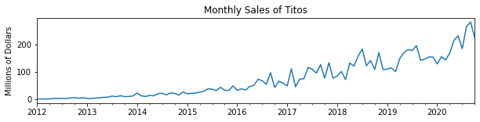
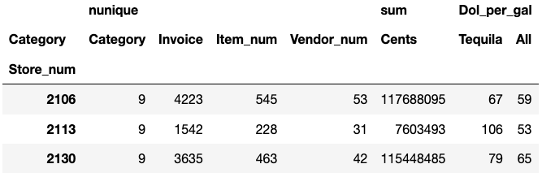
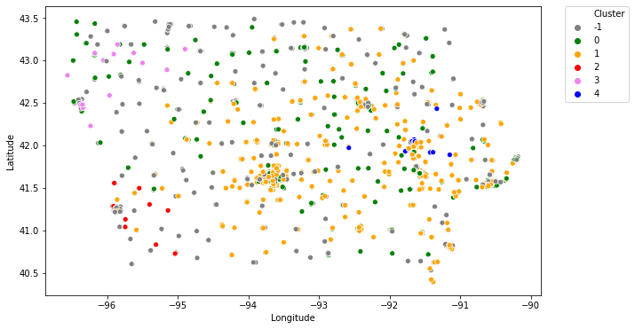

# Segmenting the Iowa Wholesale Liquor Market

The Data Incubator  
2020 Fall  
Capstone Project

# 1 Business Objective

This product uses machine learning
(feature engineering and density-based clustering)
to partition the Iowa liquor market into discrete components.
Market segmentation will benefit wholesalers (the intended user) by allowing them to:
- target advertising by region
- identify potential buyers (liquor stores)
- more effectively partition sales regions for salespersons

In Iowa, wholesale liquor is a 300 million dollar a year market (see Table 1)
with 452 sellers (brands/manufacturers)
and 2415 buyers (liquor stores) (see Note 2).
Wholesale transactions 
are reported to the Iowa Alcoholic Beverages Division,
who make the data (from 2012 to present) available at:
https://data.iowa.gov/Sales-Distribution/Iowa-Liquor-Sales/m3tr-qhgy
The dataset consists of about 19 million transactions
from 2012 through the present, and is about 4.5 GB [See Table 3 below].

Each liquor store typically carries around 35 brands (see Table 4 below),
and each brand employs salespersons that work the a number of liquor stores.
For context, in the Manhattan liquor market, a salesperson
might have a territory of 50 liquor stores.

#### Table 1

|                    |   Brandy |   Cocktail |   Gin |   Liqueur |   Neutral |   Rum |   Tequila |   Vodka |   Whiskey |    All |
|:-------------------|---------:|-----------:|------:|----------:|----------:|------:|----------:|--------:|----------:|-------:|
| USD (Millions)     |    14.58 |       4.37 |  7.27 |     44.82 |      0.85 | 32.95 |     19.77 |   73.73 |     99.17 | 297.50 |
| Liters (Millions)  |     0.60 |       0.60 |  0.49 |      2.65 |      0.04 |  2.34 |      0.85 |    6.28 |      5.19 |  19.05 |
| Gallons (Millions) |     0.16 |       0.16 |  0.13 |      0.70 |      0.01 |  0.62 |      0.22 |    1.66 |      1.37 |   5.02 |

#### Note 2

Note that the Iowa wholesale market excludes
on-premise retailers (ie, restaurants and bars),
who must buy through an off-premise retailer (ie, a liquor store).

#### Table 3

|                       | filename           | filesize | number of rows |
|:----------------------|-------------------:|---------:|---------------:|
| Raw data              |            raw.csv |     4.5G |       19 884 006 |
| Cleaned data          |       data.parquet |     848M |       19 883 991 |
| _nonanomalous rows only_|                  |          |     _18 409 105_ |
| Downsampled data (5%) | downsample.parquet |      47M |         993 222 |

#### Table 4

_See [4-feature-engineering.ipynb](4-feature-engineering.ipynb)_

|      | %Vodka | %Whiskey | %Neutral | #Cat | #Invoice | #Item | #Vendor_num | Total$ | Latitude | Longitude | $/gal_tequila | $/gal_all |
|:-----|-----:|-----:|-------:|--:|------------:|-----------:|---------:|-------:|-------:|-------:|----------:|-----------:|
| mean | 0.26 | 0.33 | 0.0019 | 8 | 1230 | 232 | 28 | 187595 | 41.9753 | -93.0522 | 109 | 58 |

# 2 Data Ingestion

_See [2-data-ingestion.ipynb](2-data-ingestion.ipynb)_

The dataset after cleaning and formatting (but before feature engineering)
has 25 columns. See Table 5 for summary stats for 12 columns.
By cleaning the data we are able to reduce the filesize from 4.5 GB to 848 MB. (See Table 3 above.)

After removing some anomolies, the `Invoice` column becomes a uniquely identifying column,
so we _could_ write `df = df.set_index('Invoice')`.
However, we keep the index as is
in case users run these notebooks in future months
without manually cleaning any new anomolies
the have appeared in the Iowa Alcoholic Beverages Division dataset.

After cleaning, we add the new feature `Category`, which groups of the subcategories in the original dataset into 9 major categories.
We also use detect errors in the data by investigating outliers (such as locations not in Iowa) 
and by comparing redundant features (such as checking `Bottle_cost` times `Bottle_count` equals `Cents`).

Finally we generate a random column and use it to take a 5% sample to assist in later analysis.

#### Table 5

|      | dtype          |    count |   null count |   unique | top                 |   freq | first               | last                |
|:-----|:---------------|---------:|-------------:|---------:|:--------------------|-------:|:--------------------|:--------------------|
| Date | datetime64[ns] | 19883991 |            0 |     2157 | 2017-12-22 |  16674 | 2012-01-03 | 2020-10-30 |
| Invoice         | object  | 19883991 |            0 | 19883991 | 128404200011                 |        1 |
| Store           | object  | 19883991 |            0 |     2613 | Hy-Vee #3 / Bdi / Des Moines |   169816 |
| Address         | object  | 19804064 |        79927 |     2415 | 3221 Se 14Th St              |   231054 |
| City            | object  | 19804065 |        79926 |      456 | Des Moines                   |  1730907 |
| Subcategory     | object  | 19858951 |        25040 |      110 | Canadian Whiskies            |  1916720 |
| Vendor          | object  | 19883991 |            0 |      452 | Diageo Americas              |  3356016 |
| Item            | object  | 19883991 |            0 |     8666 | Black Velvet                 |   515736 |

|               | dtype   |    count |   null count |   mean |   std |   min |   0.01% |   99.99% |      max |
|:--------------|:--------|---------:|-------------:|-------:|------:|------:|--------:|---------:|---------:|
| Cents         | int32   | 19883991 |            0 |  13527 | 47022 |     0 |       0 |  1620000 | 27955728 |
| Gallons       | float32 | 19883991 |            0 |      2 |     9 |     0 |       0 |      277 |     3963 |
| Longitude     | float32 | 17976922 |      1907069 |    -91 |     3 |  -105 |     -97 |      -90 |      -74 |
| Latitude      | float32 | 17976922 |      1907069 |     42 |     1 |    39 |      40 |       43 |       45 |

# 3 Visualization
### Choropleth

_See [3-choropleth.ipynb](3-choropleth.ipynb)_

The Iowa liquor market is not homogeneous.
For example, consider the ratio of sales of vodka to sales of whiskey.
Regions around Des Moines, Davenport, Cedar Rapids, and Iowa City 
purchase more vodka then whiskey, perhaps due to restaurant density.
The rest of Iowa purchases more whiskey than vodka.

### Time Series

_See [3-time-series.ipynb](3-time-series.ipynb)_

The market has been growing since 2012.
However, growth is mostly driven by vodka and whiskey, and more recently, Liqueur.

Looking at sales of all categories and overlaying years 2012-2020, we see
that this secular growth trend in the market is not limited to any particular time of year.

Averaging over all years, liquor purchases are highest in October, November, December.
However, this cyclical increase is entirely driven by whiskey in Iowa.
In the NYC liquor market, sales of both whiskey and vodka go up in the 4th quarter,
as restaurants serve more vodka-based mixed-drinks.
In future analysis, cyclical changes in vodka purchases (aggregated by liquor store) may allow us to identify which liquor stores sell extensively to restaurants, and which liquor stores mostly sell directly to consumers.

We can also aggregate by Item. Since the same product may be sold over different names, we need to group the items by keyword into product lines. TF-IDF can be used to find keywords that are rare overall, but common for a single brand, however the keywords generated were not as good a brand-exclusivity search. See 3-time-series.ipynb. In future analyses, TF-IDF cosine similarity may allow us to cluster items into product lines directly.

We see that sales have not improved for every product line.
For example, compare Tito's Vodka and Ciroc.

Note that Ciroc is a rapper-sponsored liqueur,
and it is common knowledge in liquor sales that liqueurs
tend to be more prone to fads.

# 4 Machine Learning

## Feature Engineering

_See [4-feature-engineering.ipynb](4-feature-engineering.ipynb)_

The original dataset, after cleaning, is a ledger of some 19 million transactions.

Here are the first 3 rows.

|    |      Invoice | Date                |   Store_num | Store                         | Address            | City       |   Zip |   County_num | County   |   Subcategory_num | Subcategory             |   Vendor_num | Vendor          |   Item_num | Item                               |   Bottle_pack |   Bottle_mL |   Bottle_cost |   Bottle_retail |   Bottle_count |   Cents |    mL |   Gallons |   Longitude |   Latitude | Category   | Anomalous   |   Random |
|---:|-------------:|:--------------------|------------:|:------------------------------|:-------------------|:-----------|------:|-------------:|:---------|------------------:|:------------------------|-------------:|:----------------|-----------:|:-----------------------------------|--------------:|------------:|--------------:|----------------:|---------------:|--------:|------:|----------:|------------:|-----------:|:-----------|:------------|---------:|
|  0 | 126831400106 | 2020-04-27 00:00:00 |        2190 | Central City Liquor, Inc.     | 1460 2Nd Ave       | Des Moines | 50314 |           77 | Polk     |           1012100 | Canadian Whiskies       |          260 | Diageo Americas |      10804 | Crown Royal Regal Apple            |            44 |         200 |           472 |             708 |              6 |    4248 |  1200 |      0.31 |    -93.6198 |    41.6057 | Whiskey    | False       | 0.929616 |
|  1 | 126855200028 | 2020-04-27 00:00:00 |        5339 | Prime Star                    | 395 Western Avenue | Marengo    | 52301 |           48 | Iowa     |           1901200 | Special Order Items     |          330 | Gemini Spirits  |     988037 | Sooh Margaritaville Silver Tequila |            12 |        1000 |           784 |            1176 |              2 |    2352 |  2000 |      0.52 |    -92.0744 |    41.793  |            | False       | 0.316376 |
|  2 | 126788200025 | 2020-04-24 00:00:00 |        4092 | Fareway Stores #077 / Norwalk | 1711 Sunset Dr     | Norwalk    | 50211 |           91 | Warren   |           1031200 | American Flavored Vodka |          260 | Diageo Americas |      77994 | Smirnoff Red, White & Berry        |             6 |        1750 |          1475 |            2213 |             30 |   66390 | 52500 |     13.86 |    -93.6755 |    41.4833 | Vodka      | False       | 0.183919 |

Before running cluster analysis on liquor store, we need to engineer a few features.
To head of survivorship bias, we first filter to 2019 by writing `df[df.Date.dt.year==2019]`.
Next we pivot the dataset by `Store_num`, meaning that the index will be `Store_num`
Then we engineer the following features.
- We aggregate by `sum` over `Cents` (sales) to get **Totals sales**.
- We aggregate by `nunique` over `Vendor_num`, `Category`, `Item_num`, and `Invoice`
  to get the number of **unique brands**, **unique categories** (out of 9), **unique items**,
  as well as the **total number of transactions**.
- We separately engineer the average price in dollars/gallon,
  still indexed by `Store_num` but now additionally columned by `Category`.
  In fact, we do this pivot and aggregate `Gallons` by `sum`,
  and then repeat with `Cents` (sales) to get (#1).
  We divide the two resulting dataframes to get **dollars/gallon**
  for each store, grouped by `Category` (there are 9).
- Finally, we separately engineer the **sales (USD) proportion by category**
  by taking the previously defined dataframe (#1)
  and the dividing by its last column (`All`).
  Originally we also computed **sales (gal)proportion by category**,
  but dropped the feature as it is already
  adequately described by combine interaction of "sales (USD) proportion by category"
  and "dollars/gallon"

#### Feature selection

Finally I chose the following 12 features to run clustering on
based on which ones had the largest standard deviation.

Here are the first 3 columns of the result.

To better understand these new features, here are selected histograms.
Observe that total sales is approximately exponentially distributed,
whereas the others are approximately normal (with right-skew).

## Clustering

_See [4-clustering.ipynb](4-clustering.ipynb)_

Using a density-based clustering algorithm on the features selected above produces 5 clusters, two that conver the whole state, and three localized clusters.

#### Interpretation

_See tables at bottom of [4-clustering.ipynb](4-clustering.ipynb)_

- Cluster 0: everywhere in Iowa, portfolio of 30 vendors on average, 180k sales, carries 250 products, carries cheap tequila
- Clusters 1-4: portfolio of 20 vendors, carries 100 products, carries expensive tequila and no/few neutral grain spirits
  - Cluster 1 stores are everywhere in Iowa except the northwest, 50k in sales
  - Cluster 2 stores carry less Vodka and less Whiskey than average, 60k in sales 
  - Cluster 3 stores are in the northwest and carry less Vodka and more Whiskey than average, 50k in sales
  - Cluster 4 stores are in the eastern collegiate region of Iowaand sells more Vodka than Whiskey, 25k in sales; all carry exactly 0 neutral grain spirits, 

This density-based clustering algorithm has difficulty classifying large liquor stores (average sales 350k, 35 brands) with expensive tequila. These may be due to larger warehouse-type stores being located in (relatively) geographically isolated lots with parking.

# 5 Deliverable
The current [README](README.md)
